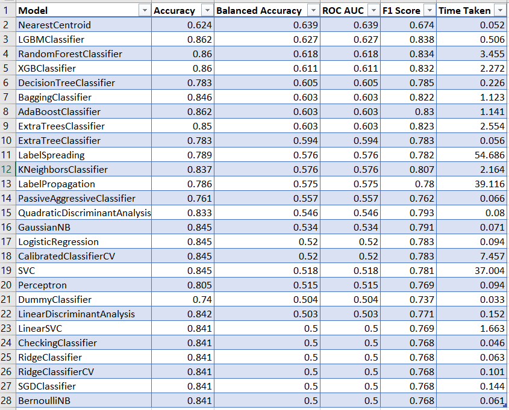

# Credit-Risk-Analysis-using-LightGBM-Classifier

### Context : 
   Banks need to protect their interest before it can take risk on you and issue credit card to you. Banks use their previous credit card holders records for understanding the patterns of the card holders. It is a lot more complex process to predict whether a person who they do not know at personal level, will be a defaulter or not. Banks, along with the data from their own records, also use CIBIL data. Based on all this data, banks want to develop a pattern that will tell them who are likely to be a defaulter and who are not.
### Objective :
   We have to use this dataset to generate a classification model that can successfully predict for a new applicant with recorded data for given parameters in the data set, if he is likely to be a defaulter.
### Algorithms use for Classification :
- LightBGMClassifier
- ExtraTreesClassifier
- RandomForestClassifier

In this model i've used <code>LazyClassifier</code> algorithm before applying hyperparameter tuning.This algorithm helped me to get right classification algorithm for this dataset. When we'll fit training & testing datasets to Lazypredict algorithm,it will show the accuracy of model by using different algorithms with their default value.
#### The output of LazyClassifier algorithm :

  

### Process Overview :
- Introduction
- Import Libraries
- Load Dataset
- Exploratory Data Analysis
- Data Visualization
- Data Preprocessing
  - Cleaning missing values     
  - Encoding categorical values
  - Remove outliers 
  - Checking Data Correlation
- Split the dataset
- Apply Lazypredict
- Hyperparameter Tuning
- Model Building¶
- Save the Model
- Find prediction
